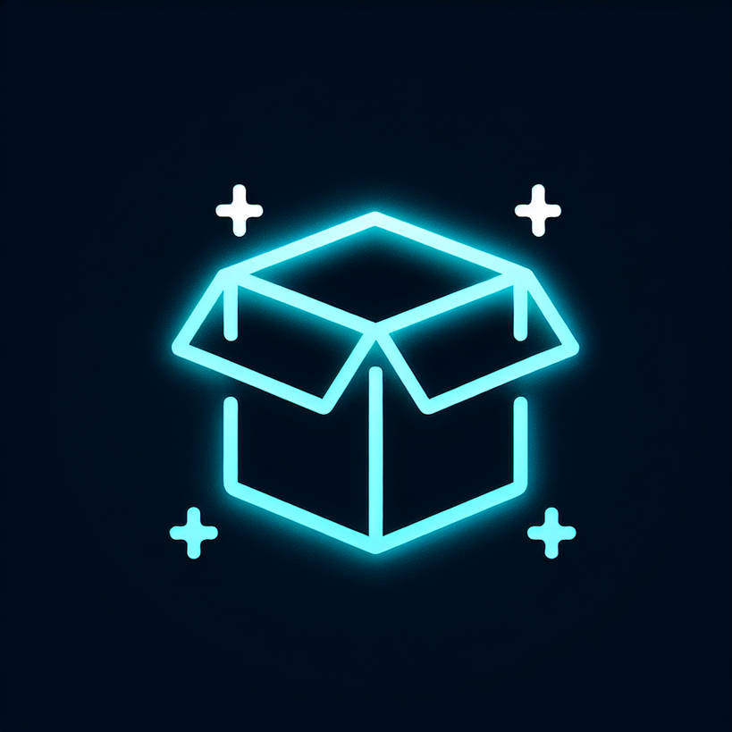

<a id="readme-top"></a>

[![Forks][forks-shield]][forks-url]
[![Stargazers][stars-shield]][stars-url]
[![MIT License][license-shield]][license-url]


<br />
<div align="center">
  <a href="https://github.com/Emananii/MyDuka">
    
  </a>

  <h3 align="center">MyDuka – A Digital Inventory & Sales Management System for SMEs</h3>

  <p align="center">
    Streamlining retail operations with intuitive inventory, POS, and reporting.
    <br />
    <a href="https://github.com/your_username/MyDuka"><strong>Explore the repo »</strong></a>
    <br />
    <br />
    <a href="https://your_demo_link.netlify.app/">View Demo</a>
    ·
    <a href="https://github.com/your_username/MyDuka/issues/new?labels=bug&template=bug-report---.md">Report Bug</a>
    ·
    <a href="https://github.com/your_username/MyDuka/issues/new?labels=enhancement&template=feature-request---.md">Request Feature</a>
  </p>
</div>

<details>
  <summary>Table of Contents</summary>
  <ol>
    <li><a href="#about-the-project">About The Project</a></li>
    <li><a href="#key-features">Key Features</a></li>
    <li><a href="#user-roles--permissions">User Roles & Permissions</a></li>
    <li><a href="#target-users">Target Users</a></li>
    <li><a href="#technical-stack">Technical Stack</a></li>
    <li><a href="#deployment-goals">Deployment Goals</a></li>
    <li><a href="#expected-outcomes">Expected Outcomes</a></li>
    <li><a href="#future-enhancements">Future Enhancements</a></li>
    <li><a href="#getting-started">Getting Started</a></li>
    <li><a href="#roadmap">Roadmap</a></li>
    <li><a href="#contributing">Contributing</a></li>
    <li><a href="#license">License</a></li>
    <li><a href="#contact">Contact</a></li>
    <li><a href="#acknowledgments">Acknowledgments</a></li>
  </ol>
</details>

---

## About The Project

**MyDuka** is a full-stack, role-based inventory and point-of-sale (POS) application meticulously designed to **streamline retail operations for small and medium-sized enterprises (SMEs)**. It directly addresses the critical challenges of manual stock management, fragmented procurement workflows, and the absence of real-time reporting tools that plague many businesses.

MyDuka empowers store owners, managers, clerks, and cashiers to collaboratively manage inventory, accurately record sales, diligently monitor supplier payments, and gain valuable insights into business performance through intuitive dashboards and automated reports.

---

## Key Features

MyDuka offers a robust digital platform that automates and centralizes core inventory management and sales processing operations. It provides a structured and secure role-based workflow ensuring accountability, operational efficiency, and business intelligence.

* **Authentication & Role Management**
    * Secure JWT-based authentication with token expiration.
    * Four distinct user roles: Merchant (Business Owner), Admin (Store Manager), Clerk (Inventory Personnel), and Cashier (POS Operator).
* **Inventory Management**
    * Record incoming stock, spoilage, and pricing details.
    * Track paid vs. unpaid items for supplier accountability.
    * Automated stock alerts and restocking requests initiated by clerks.
* **Point of Sale (POS)**
    * Dedicated Cashier interface for product search, sales creation, and transaction processing.
    * Automatic inventory deduction upon completed sales.
    * Detailed sales records including cashier ID, timestamp, and item breakdown.
* **Supply Workflow**
    * Clerks can request restock for low inventory items.
    * Admins approve or reject requests with remarks.
    * Payment status updates once suppliers are compensated.
* **User Management**
    * Merchants can create, deactivate, or delete Admins.
    * Admins can manage Clerks and Cashiers.
    * Account deactivation preserves historical data for auditing.
* **Reporting & Visualization**
    * Dynamic bar charts, line graphs, and tabular reports.
    * **Merchant view:** Cross-store comparisons and comprehensive product performance analysis.
    * **Admin view:** Store-level performance, spoilage tracking, and profitability insights.
    * **Cashier and Clerk dashboards:** Tailored for efficient daily task management.

---

## User Roles & Permissions

| Role      | Core Capabilities                                                                                                      |
| :-------- | :--------------------------------------------------------------------------------------------------------------------- |
| **Merchant** | User and store management, full business analytics, supplier payment monitoring.                                       |
| **Admin** | Clerk/Cashier management, approval of supply workflows, comprehensive store-level reporting.                             |
| **Clerk** | Stock data entry, accurate restock request generation.                                                                 |
| **Cashier** | Efficient sales processing through POS, real-time inventory deduction.                                                 |

---

## Target Users

MyDuka is ideal for:

* **Small and medium-sized businesses (SMEs)** such as retail shops, mini-markets, and pharmacies.
* **Store chains** requiring centralized inventory and reporting capabilities.
* **Businesses looking to transition** from manual inventory tracking to a digital, automated system.

---

## Technical Stack

MyDuka is built using a modern and robust technical stack to ensure scalability, performance, and maintainability.

* **Frontend:**
    * **React.js** (with Redux Toolkit or Context API for state management)
    * **Figma wireframes** (mobile-first and responsive design)
    * **Charting libraries** (e.g., Recharts, Chart.js) for compelling visual reports
* **Backend:**
    * **Python (Flask)**
    * **RESTful API architecture**
    * **SQLite3 database** (for local development, pre-production)
    * **JWT authentication** for secure access
* **Testing:**
    * **Frontend:** Jest for comprehensive component and UI tests
    * **Backend:** Minitest or Pytest for robust model and route validations

---

## Deployment Goals

* **Hosting:** Render
* Automated seeding of sample data for testing and effective demos.

---

## Expected Outcomes

Upon completion, MyDuka will deliver:

* A production-ready, end-to-end inventory and POS platform.
* Secure, auditable, role-based access for business personnel.
* A responsive and mobile-friendly UI optimized for real-world store usage.
* Intuitive reporting dashboards for smart, data-informed decision-making.
* A scalable foundation that readily supports future enhancements.

---

## Future Enhancements

These features can be considered for future releases to further expand MyDuka's capabilities:

* Customer-facing e-commerce interface.
* Payment gateway integrations (e.g., M-Pesa, Stripe).
* Advanced financial accounting or tax calculations.
* Supplier registration and invoicing.

---

## Getting Started

To get a local copy up and running, follow these simple steps.

### Prerequisites

* npm
    ```sh
    npm install npm@latest -g
    ```
* Python 3.x
* pip

### Installation

1.  Clone the repository:
    ```sh
    git clone [https://github.com/your_username/MyDuka.git](https://github.com/your_username/MyDuka.git)
    ```
2.  Navigate into the `backend` directory:
    ```sh
    cd MyDuka/backend
    ```
3.  Create a virtual environment:
    ```sh
    python3 -m venv venv
    ```
4.  Activate the virtual environment:
    * On macOS/Linux:
        ```bash
        source venv/bin/activate
        ```
    * On Windows:
        ```cmd
        .\venv\Scripts\activate
        ```
5.  Install the required Python packages:
    ```sh
    pip install -r requirements.txt
    ```
6.  Set up environment variables:
    Create a `.env` file in the `backend` directory and add your secret key:
    ```
    SECRET_KEY=your_super_secret_key_here
    ```
    *(Replace `your_super_secret_key_here` with a strong, random string.)*

7.  Run database migrations (if applicable for your Flask setup, e.g., Flask-Migrate):
    ```sh
    flask db upgrade
    ```

8.  Start the Flask backend server:
    ```sh
    flask run
    ```
    The API will typically be accessible at `http://127.0.0.1:5000` (or `http://localhost:5000`).

### Testing API Endpoints

Once the backend server is running, you can test the API endpoints using tools like [Postman](https://www.postman.com/), [Insomnia](https://insomnia.rest/), or `curl`.

Here are some example endpoints and how you might interact with them:

**1. User Registration (Example for a new Merchant):**

* **Endpoint:** `POST /register`
* **Body (JSON):**
    ```json
    {
        "username": "merchant_user",
        "password": "strong_password",
        "role": "merchant"
    }
    ```
* **Expected Response:** A JWT token and user details upon successful registration.

**2. User Login:**

* **Endpoint:** `POST /login`
* **Body (JSON):**
    ```json
    {
        "username": "merchant_user",
        "password": "strong_password"
    }
    ```
* **Expected Response:** A JWT token which you will use for authenticated requests.

**3. Get All Products (Requires Authentication):**

* **Endpoint:** `GET /products`
* **Headers:**
    * `Authorization: Bearer <your_jwt_token>` (Replace `<your_jwt_token>` with the token obtained from login)
* **Expected Response:** A list of product objects.

**4. Add a New Product (Requires Admin/Merchant/Clerk Authentication):**

* **Endpoint:** `POST /products`
* **Headers:**
    * `Authorization: Bearer <your_jwt_token>`
* **Body (JSON):**
    ```json
    {
        "name": "Sugar 1kg",
        "price": 180.00,
        "current_stock": 100,
        "sku": "SUG001"
    }
    ```
* **Expected Response:** The newly created product object.

**5. Process a Sale (Requires Cashier Authentication):**

* **Endpoint:** `POST /sales`
* **Headers:**
    * `Authorization: Bearer <your_jwt_token>`
* **Body (JSON):**
    ```json
    {
        "items": [
            {"product_id": 1, "quantity": 2},
            {"product_id": 3, "quantity": 1}
        ]
    }
    ```
* **Expected Response:** Details of the completed sale, and the stock of the sold items will be automatically reduced.

**Testing with `curl` (Example Login Request):**

```bash
curl -X POST -H "Content-Type: application/json" \
     -d '{"username": "merchant_user", "password": "strong_password"}' \
     [http://127.0.0.1:5000/login](http://127.0.0.1:5000/login)
```


---

## Roadmap

* [x] Initial Project Setup (Frontend & Backend)
* [x] User Authentication & Authorization (JWT)
* [x] Basic User Role Management
* [x] Core Inventory Management (Add, Edit, Delete Stock)
* [x] Point of Sale (POS) Interface & Sales Processing
* [x] Automatic Inventory Deduction on Sales
* [x] Basic Reporting & Data Visualization for Merchants/Admins
* [ ] Supply Workflow (Restock Requests, Approvals)
* [ ] Detailed Payment Tracking for Suppliers
* [ ] Enhanced Reporting Dashboards (Spoilage, Profitability)
* [ ] Responsive UI for various devices

<p align="right">(<a href="#readme-top">back to top</a>)</p>

---

## Core Contributors

| Contributor        | Core Responsibilities                 |
| :----------------- | :------------------------------------ |
| Emmanuel Ndiritu   | Scaffolding, Sales & POS              |
| Viktor Mugo        | Stores & QA                           |
| Jackson Mativo     | Authentication & User Registration    |
| Paul Ashton        | Inventory & Documentation             |


If you’ve been invited to collaborate:

1.  Fork the project
2.  Create your Feature Branch (`git checkout -b feature/AmazingFeature`)
3.  Commit your Changes (`git commit -m 'Add some AmazingFeature'`)
4.  Push to the Branch (`git push origin feature/AmazingFeature`)
5.  Open a Pull Request

---

## License

Distributed under the MIT License. See `LICENSE` for more information.

---

## Live Demo (upcoming)
[MyDuka Live Demo](https://your_demo_link.netlify.app/)

---

## Contact

* [MyDuka Support] - [Your Email]
* Project Link: [https://github.com/Emananii/MyDuka](https://github.com/Emananii/MyDuka)

---

## Acknowledgments

* [Google Fonts](https://fonts.google.com/)
* [Font Awesome](https://fontawesome.com/)
* [React Icons](https://react-icons.github.io/react-icons/)
* [Recharts](https://recharts.org/en-US/) / [Chart.js](https://www.chartjs.org/)
* [Flask Documentation](https://flask.palletsprojects.com/en/latest/)
* [React Documentation](https://react.dev/)

<p align="right">(<a href="#readme-top">back to top</a>)</p>

[contributors-shield]: https://img.shields.io/github/contributors/your_username/MyDuka.svg?style=for-the-badge
[contributors-url]: https://github.com/your_username/MyDuka/graphs/contributors
[forks-shield]: https://img.shields.io/github/forks/your_username/MyDuka.svg?style=for-the-badge
[forks-url]: https://github.com/your_username/MyDuka/network/members
[stars-shield]: https://img.shields.io/github/stars/your_username/MyDuka.svg?style=for-the-badge
[stars-url]: https://github.com/your_username/MyDuka/stargazers
[license-shield]: https://img.shields.io/github/license/your_username/MyDuka.svg?style=for-the-badge
[license-url]: https://github.com/your_username/MyDuka/blob/main/LICENSE